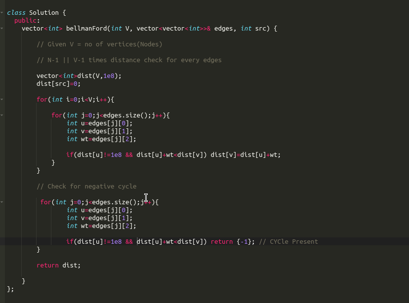

# Reference_pics

### This repo contains pics for quick revison and references to the previous studied resources for **QUICK VISUALISATION**

# HTML/CSS

# SQL

- SQL keywords are NOT case sensitive: select is the same as SELECT

- Use semicolon at the end of each SQL statement

- How to Test for NULL Values?

It is not possible to test for NULL values with comparison operators, such as =, <, or <>.

We will have to use the IS NULL and IS NOT NULL operators instead.

- The BETWEEN operator selects values within a given range. The values can be numbers, text, or dates.

    SELECT * FROM Products  
    WHERE ProductName BETWEEN   'Carnarvon Tigers' AND    'Mozzarella di Giovanni'  
    ORDER BY ProductName;  

- NOT BETWEEN Example

    To display the products outside the range of the previous example, use NOT BETWEEN:

### ALIASES

- Note: Single or double quotation marks are required if the alias name contains spaces:

### JOIN STATEMENTS

A JOIN clause is used to combine rows from two or more tables, based on a related column between them.

### Update Table

UPDATE Customers  
SET ContactName = 'Alfred Schmidt', City = 'Frankfurt'  
WHERE CustomerID = 1;  

- The IN operator allows you to specify multiple values in a WHERE clause.

    The IN operator is a shorthand for multiple OR conditions.

# GRAPHS

## Dijkstra's Algo

- Finds shortest distance from source to all other nodes

- Doesn't work with **Negative Weights** 

- TC: O(V + E log V) with min-heap

### Approaches

#### Naive

#### Use Queue with in_queue Marking

#### Use PQ

#### Using SET

## Bellman Ford

- Improvement from Dijkstra to handle *Negative Weights*

- Can also detect *Negative Cycles*

- TC: O(V × E)

- Algorithm

    - Let n = no of nodes

    - Saare edges pr (n-1) times distance check kro

    - To detect negative cycle

        - saare Edges pr one time more dist check kro

        - If any distance gets updated => Negative cycle present

 

## Floyd-Warshall

- All pair Shortest-Path

- Handles Negative weights

    - *** If No Negative Wt Present *** Then apply Dijkstra on each node

- Detect Negative Cycles

- TC: O(V³) where V=No of vertices(Nodes)

- Algorithm

 